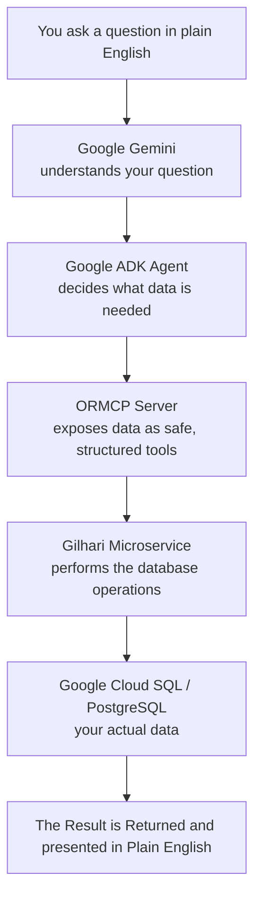

# 📚 Smart Library Management

### An AI Agentic Architecture to Access Database with Natural Language Query
Smart Library Management is an AI-powered library management system that demonstrates a simpler way for AI agents to work with relational databases. Using an ORMCP MCP server, it exposes the library database as an intuitive object-oriented model (Books, Members, Staff, Transactions), allowing agents to query and update data without dealing with raw schemas or writing SQL


## What Is This?

If you have a Librray Mangement System, and Want to know *"Which books did Alice borrow last month?"* or *"How Many Books did John Issue"* You either Write SQL Queries or Use AI Agent to write those SQL Queries. 

But if the System has AI agents buld in itself, which can query Such questions  in a faster way.... That's exactly what this project does.

**Smart Library Management** is a working example of an AI-powered system that lets you query and manage a library's data — books, members, staff, and borrowing transactions — using everyday natural language. An AI agent understands your question, figures out what data it needs, and safely retrieves or updates that data in a real database.

## How It Works

Instead of allowing the AI model to generate SQL, the agent communicates with an **ORMCP (Object Relational Model Context Protocol)** server, which exposes your library's data as simple, structured tools the AI can call. The ORMCP server, in turn, talks to a **Gilhari** microservice, which performs the actual database operations on PostgreSQL.


---

## What Does This Improve?

Traditionally, connecting an AI model to a database means either:
- Letting the AI generate raw SQL queries (risky — mistakes can corrupt or expose data), or
- Writing custom backend code for every possible question someone might ask (slow and inflexible).

This project takes a safer, smarter third path: the AI agent talks to your data through **structured, well-defined objects** (like "Book," "Member," "Transaction") instead of raw SQL. This means:

- ✅ **Safer** — the AI never writes or executes arbitrary SQL against your database.
- ✅ **Faster to build** — no manual REST APIs or database schema code required.
- ✅ **Flexible** — works with natural language questions, not rigid pre-built queries.
- ✅ **Cloud-ready** — built to run with a cloud-hosted PostgreSQL database out of the box.

If you're curious how AI agents can be safely connected to real-world business data, this repository is a complete, runnable example — from the AI agent, to the data-access layer, to the database itself.

---

## About the Project

**Smart Library Management** is an AI-powered library management system that demonstrates how Large Language Models can interact with relational databases through **ORMCP (Object Relational Model Context Protocol)** instead of directly writing SQL queries.

The project integrates:

- **Google Agent Development Kit (ADK)** for building AI agents
- **Google Gemini** as the Large Language Model
- **ORMCP** as the bridge between the AI agent and the database
- **Gilhari** microservice framework for object-relational mapping
- **Google Cloud SQL (PostgreSQL)** for cloud-hosted relational data

Instead of allowing the AI model to generate SQL, the agent communicates with the ORMCP server, which exposes business objects through MCP tools. ORMCP internally communicates with the Gilhari microservice, which performs CRUD operations on a PostgreSQL database. This architecture enables secure, structured, and object-oriented access to relational data while taking advantage of modern AI agents.

- **JDX** - JDX is a Java ORM engine that reverse-engineers relational database schemas into a curated Java/JSON object model — the foundational data-access layer beneath Gilhari.

- **Gilhari** - Gilhari packages a JDX object model as a RESTful microservice — exposing your database as a curated, object-oriented REST API with no hand-written server code.
ORMCP
- **ORMCP** - a Model Context Protocol(MCP) server, it bridges AI agents to your database through Gilhari. It Gives them a governed, object-oriented view of your data and not raw SQL or table rows.
## Project Structure

```
SMART-LIBRARY-MANAGEMENT
│
├── Library_AI_Agents/       # Google ADK AI agents - Contains all the Agentic AI Files
├── smart_library_gilhari/   # Gilhari microservice project
├── libs/                    # Required libraries (To be added fron Gilhari SDK)
├── config/                  # Configuration files (To be added fron Gilhari SDK)
└── LICENSE.txt
```
### About the library_ai_agents Directory

The library_ai_agents directory contains the AI agents for the Smart Library Management System. Built using the Google Agent Development Kit (ADK), these agents enable users to interact with library data using natural language. The directory includes specialized agents for handling operational queries and generating analytical insights, each designed to perform a specific role while sharing the same backend services.

### About the smart_library_gilhari Directory

The Gilhari microservice is the backend service that manages the Smart Library Management data model and database operations. It exposes the application's object model as REST APIs, enabling the ORMCP server and AI agents to securely access and manipulate relational data without directly interacting with the database. The directory contains the whole Gilhari Configurations for the object model used here.

Both Directories have respective README files in the directories, Refer them for more Details.

## Technology Stack

- Google Gemini API
- Google Agent Development Kit (ADK)
- Google Cloud Platform (GCP)
  - Cloud SQL (PostgreSQL)
- ORMCP
- Gilhari Microservice Framework
- Docker
- PostgreSQL
- Python
- Java

## System Architecture

```
Google Gemini
       │
       ▼
Google ADK Agent
       │
       ▼
ORMCP Server (HTTP)
       │
       ▼
Gilhari Microservice
       │
       ▼
Google Cloud SQL (PostgreSQL)
```

## Getting Started

### 1. Create a PostgreSQL Database on Google Cloud

Create a Cloud SQL PostgreSQL instance.

**Cloud SQL Configuration**

```
Database Engine : PostgreSQL
Instance ID     : <INSTANCE_ID>
Password        : <PASSWORD>
```

> **Important:** Add your machine's public IP address to the authorized networks. Without this step, the Docker container will not be able to connect to Cloud SQL.

```
Cloud SQL -> Connections -> Networking -> Authorized Networks

Name    : My Laptop
Network : <YOUR_PUBLIC_IP>/32
```

### 2. Get a Gemini API Key

Go to the link below and create an API key:

```
https://aistudio.google.com/app/api-keys
```

Paste that key in the `.env` file in the agent's folder:

```
GOOGLE_GENAI_USE_ENTERPRISE=0
GOOGLE_API_KEY=<your api key>
```

### 3. Configure Gilhari

Open the JDX configuration file and configure the database connection.

```text
JDX_DATABASE
JDX:jdbc:postgresql://<PUBLIC_IP_OF_CLOUD_SQL>:5432/postgres?user=postgres&password=<PASSWORD>;
JDX_DBTYPE=POSTGRES;
DEBUG_LEVEL=3
```

Replace:

- `<PUBLIC_IP_OF_CLOUD_SQL>`
- `<PASSWORD>`

with your own values.

## Running the Project

1. Start your Cloud SQL instance.
2. Open Docker.

**Start Gilhari**

3. Navigate to:

    ```
    smart_library_gilhari
    ```

4. Run the following scripts in order:

    ```text
    compile.cmd

    build.cmd

    run_docker_app.cmd
    ```

5. Finally, populate the database from a new terminal (same folder):

    ```text
    curlCommandsPopulate.cmd
    ```

The Gilhari REST service should now be available locally.

## Starting the ORMCP Server

1. Open Command Prompt (or PowerShell), and set the ORMCP token:

    ```cmd
    set ORMCP_TOKEN=<YOUR_ORMCP_KEY>
    ```

2. Install the ORMCP server:

    ```cmd
    pip install --index-url https://%ORMCP_TOKEN%@pypi.fury.io/softwaretree/ --extra-index-url https://pypi.org/simple ormcp-server
    ```

3. Configure environment variables:

    ```cmd
    set GILHARI_BASE_URL=http://localhost:80/gilhari/v1/
    set MCP_SERVER_NAME=MyORMCPServer
    ```

4. Start the server in HTTP mode:

    ```cmd
    ormcp-server --mode http --port 8080
    ```

The ORMCP server will now expose MCP tools over HTTP.

## Running the Google ADK Agent

1. Navigate to:

    ```
    Library_AI_Agents
    ```

2. Activate the virtual environment:

    ```powershell
    .\.venv\Scripts\Activate.ps1
    ```

3. Run an agent:

    ```cmd
    adk run <agent_name>
    ```

    Or launch the web interface (open the browser and select your AI agent from the available list):

    ```cmd
    adk web --port 8000
    ```

## Project Workflow

1. User asks a question
2. Google ADK Agent receives the request
3. Agent calls ORMCP MCP tools
4. ORMCP communicates with Gilhari
5. Gilhari accesses PostgreSQL on Google Cloud
6. Data is returned back through ORMCP
7. Gemini generates the final response

## About Gilhari

This project uses the **Gilhari** microservice framework to exchange JSON data with relational databases.

Gilhari™ is a product of **Software Tree, LLC**.

Gilhari is a Docker-based microservice framework that provides persistence for JSON objects in relational databases. It is configurable using application-specific object models and relational mappings, and it exposes REST APIs for CRUD operations.

Supported operations include:

- POST
- GET
- PUT
- DELETE

This allows seamless interaction with relational databases through JSON objects.

For more information, visit: https://www.softwaretree.com

## Features

- AI-powered library management
- Google Gemini integration
- Google ADK agents
- ORMCP-based database access
- Cloud-hosted PostgreSQL database
- Gilhari object-relational persistence
- RESTful microservice architecture
- Docker deployment

## Documentation & Useful Resources

| Resource | Description | Link |
|----------|-------------|------|
| **Smart Library Object Model** | Detailed object model, entity relationships, JDX mappings, and Gilhari configuration. Refer to the `README.md` inside the `smart_library_gilhari/` directory. | `smart_library_gilhari/README.md` |
| **ORMCP Documentation** | Official ORMCP documentation and user guide. | https://github.com/SoftwareTree/ormcp-docs |
| **ORMCP Product Page** | Overview, features, and product information for ORMCP. | https://www.softwaretree.com/v1/products/ormcp/ormcp-introduction.php |
| **Gilhari Product Page** | Overview, features, and product information of Gilhari. | https://www.softwaretree.com/v1/products/gilhari/using-gilhari.php |
| **Google Agent Development Kit (ADK)** | Official documentation for building AI agents using Google ADK. | https://adk.dev/ |
| **Google Gemini API** | Documentation for the Gemini API, models, authentication, and usage. | https://ai.google.dev/gemini-api/docs |
| **Google Cloud Platform (GCP)** | Official Google Cloud documentation. | https://docs.cloud.google.com/docs |
| **Cloud SQL Documentation** | Documentation for configuring and managing Google Cloud SQL databases. | https://docs.cloud.google.com/sql/docs |

